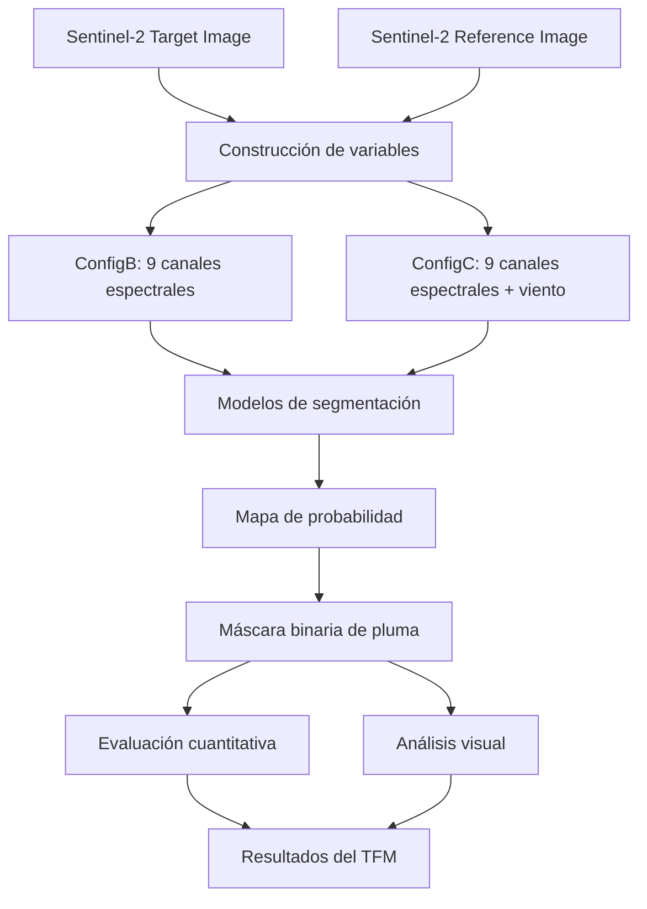
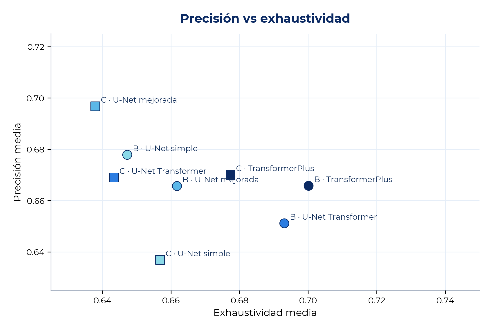
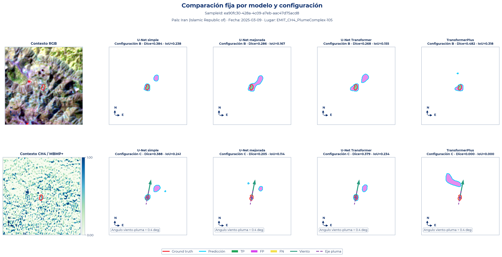

# Segmentación de Plumas de Metano en Imágenes Sentinel-2 mediante Aprendizaje Profundo

<p align="center">
  <b>Trabajo Final de Máster · Teledetección · Deep Learning · Sentinel-2 · Metano</b>
</p>

<p align="center">
  
  
  
  
  
</p>

---

## Descripción general

Este repositorio contiene el flujo experimental desarrollado para el Trabajo Final de Máster orientado a la **segmentación automática de plumas de metano en imágenes Sentinel-2** mediante modelos de aprendizaje profundo.

El proyecto combina **teledetección multiespectral**, realces espectrales sensibles al metano, comparación entre imágenes objetivo y referencia, variables meteorológicas auxiliares y arquitecturas de segmentación semántica basadas en **U-Net** y **Transformers**.

El problema se aborda como una tarea de **segmentación semántica binaria**, donde cada píxel de un parche Sentinel-2 se clasifica como:

| Clase | Descripción |
|---|---|
| Fondo | Píxeles sin pluma de metano |
| Pluma de metano | Píxeles asociados a la emisión detectada |

---

## ¿Qué genera este proyecto?

El proyecto no solo entrena modelos. También genera un conjunto completo de productos para análisis técnico, evaluación y documentación académica:

| Producto generado | Descripción |
|---|---|
| Tensores multicanal | Entradas con bandas Sentinel-2, ratios, realces y viento |
| Máscaras binarias | Segmentación de pluma frente a fondo |
| Mapas de probabilidad | Salidas continuas del modelo antes del umbral |
| Métricas por muestra | Dice, IoU, Precision, Recall, falsos positivos y falsos negativos |
| Tablas resumen | Comparación entre modelos y configuraciones |
| Figuras del capítulo de resultados | Gráficos usados para interpretar el desempeño |
| Paneles cualitativos | Comparación visual entre predicción y referencia |
| Análisis de errores | Identificación de omisiones, sobresegmentación y falsos positivos |

---

## Flujo general del proyecto



---

## Datos utilizados

El trabajo se basa en muestras derivadas de **MethaneSet / TACO Foundation**, un conjunto de datos orientado a la detección de plumas de metano a partir de imágenes Sentinel-2, imágenes de referencia, máscaras binarias y metadatos asociados.

La colección final utilizada en los experimentos se filtró considerando muestras con plumas reales, productos completos, condiciones utilizables y fuentes del sector oil & gas.

| Conjunto | Número de muestras |
|---|---:|
| Entrenamiento | 2.463 |
| Validación | 528 |
| Test | 528 |
| **Total** | **3.519** |

Cada muestra corresponde a un parche de **200 × 200 píxeles** con resolución espacial de 20 m.

---

## Configuraciones de entrada

El proyecto evalúa diferentes formas de representar la información espectral y meteorológica antes de alimentar los modelos.

### ConfigA · Línea base espectral preliminar

ConfigA fue utilizada en una fase inicial exploratoria. Incluye siete canales:

| Canal | Descripción |
|---|---|
| B8A | Banda red-edge / NIR estrecha |
| B11 | SWIR 1 |
| B12 | SWIR 2 |
| NDSWIR | Índice normalizado entre bandas SWIR |
| RatioB12B11 | Relación B12/B11 |
| RatioB12B8A | Relación B12/B8A |
| MBMP | Realce multibanda basado en comparación target-reference |

ConfigA no forma parte de la comparación final, pero sirvió para justificar la evolución hacia una configuración espectral más completa.

### ConfigB · Configuración espectral avanzada

ConfigB es la configuración principal de referencia del TFM. Incluye nueve canales:

| Grupo | Canales |
|---|---|
| Bandas Sentinel-2 | B8A, B11, B12 |
| Índices y ratios | NDSWIR, RatioB12B11, RatioB12B8A |
| Realces target-reference | MBMP, MBMPPlus, DualEnhancementB12B11 |

Esta configuración busca resaltar contrastes espectrales asociados a la presencia de metano, especialmente en las bandas SWIR.

### ConfigC · Configuración espectral con viento

ConfigC extiende ConfigB incorporando tres variables meteorológicas:

| Canal | Descripción |
|---|---|
| WindSpeed10m | Velocidad del viento a 10 m |
| WindDirCos10m | Componente coseno de la dirección del viento |
| WindDirSin10m | Componente seno de la dirección del viento |

Estas variables se incorporan como canales constantes por muestra. Su objetivo es aportar contexto físico sobre la dirección y dispersión potencial de la pluma.

---

## Modelos evaluados

Se evaluaron cuatro familias de modelos de segmentación:

| Modelo | Tipo | Rol en el experimento |
|---|---|---|
| SimpleUNet | Convolucional | Línea base U-Net |
| EnhancedUNet | Convolucional mejorada | Mayor capacidad local y estabilidad |
| TransformerUNet | Híbrido CNN + Transformer | Contexto espacial de mayor alcance |
| TransformerPlus | Transformer ampliado | Modelo con mayor capacidad contextual |

Todos los modelos producen mapas de probabilidad por píxel, que luego se transforman en máscaras binarias mediante un umbral de decisión.

---

## Diseño experimental

Los experimentos finales se organizaron alrededor de dos run tags principales:

| Run tag | Contenido |
|---|---|
| 101622 | SimpleUNet, EnhancedUNet y TransformerUNet |
| 101840 | TransformerPlus |

La comparación principal se centra en:

- ConfigB frente a ConfigC.
- Modelos convolucionales frente a modelos con componentes Transformer.
- Métricas globales y métricas por muestra.
- Análisis de falsos positivos y falsos negativos.
- Influencia del tamaño de pluma y del fluxrate.
- Evaluación cualitativa de predicciones.

---

## Resultados principales

El mejor desempeño global fue obtenido por **TransformerPlus con ConfigB**.

| Métrica | Valor aproximado |
|---|---:|
| Mean Dice | 0.6368 |
| Mean IoU | 0.5082 |
| Mean Precision | 0.6658 |
| Mean Recall | 0.7001 |
| Global Dice | 0.6779 |
| Global IoU | 0.5127 |
| Mejor umbral | 0.30 |

### Lectura general de resultados

Los resultados indican que:

- **ConfigB** fue la configuración más robusta en términos generales.
- La incorporación de viento en **ConfigC** no mejoró sistemáticamente el rendimiento.
- **TransformerPlus** obtuvo el mejor resultado global.
- Los realces espectrales SWIR fueron especialmente relevantes para la segmentación.
- Los errores más frecuentes aparecen en plumas débiles, bordes difusos, fondos heterogéneos y casos de sobresegmentación.

---

## Visualización de resultados

### Comparación global de precisión y exhaustividad

La siguiente figura resume el comportamiento global de los modelos en términos de precisión y exhaustividad.

<p align="center">
  
</p>

### Ejemplo visual de predicción

El proyecto genera paneles cualitativos para comparar la imagen de entrada, la máscara de referencia y la predicción del modelo.

<p align="center">
  
</p>

> Si esta imagen no aparece en GitHub, revisa el nombre real dentro de `assets/readme/` y actualiza la ruta en el README.

---

## Estructura de salidas generadas

```text
Outputs/
├── Experiments/
│   ├── 101622/
│   │   ├── ConfigB/
│   │   │   ├── SimpleUNet
│   │   │   ├── EnhancedUNet
│   │   │   └── TransformerUNet
│   │   └── ConfigC/
│   │       ├── SimpleUNet
│   │       ├── EnhancedUNet
│   │       └── TransformerUNet
│   │
│   └── 101840/
│       ├── ConfigB/
│       │   └── TransformerPlus
│       └── ConfigC/
│           └── TransformerPlus
│
└── ResultsChapter_101622_101840/
    ├── Figures/
    ├── Tables/
    └── Resúmenes utilizados en el capítulo de resultados
```

---

## Estructura del repositorio

```text
MethaneProjectTFM/
├── App/
├── Configs/
├── Notebooks/
├── Scripts/
│   ├── Step*.py
│   └── Scripts de procesamiento, entrenamiento, evaluación y visualización
│
├── Source/
├── Tests/
├── Outputs/
│   ├── Experiments/
│   └── ResultsChapter_101622_101840/
│
├── assets/
│   └── readme/
│
├── README.md
├── .gitignore
├── requirements.txt
└── pyproject.toml
```

---

## Reproducibilidad

El repositorio contiene los scripts principales y salidas seleccionadas necesarias para documentar y reproducir el análisis final del TFM.

Algunos archivos pesados, como tensores completos, modelos entrenados o checkpoints, pueden no estar incluidos directamente en GitHub debido a las restricciones de tamaño.

Ejemplo de ejecución del análisis de resultados:

```bash
conda activate deep

cd /data/users/kabasmen/MethaneProjectTFM

python Scripts/Step17AnalyzeResultsForChapter.py \
  --mode all \
  --ProjectRoot /data/users/kabasmen/MethaneProjectTFM \
  --OutputDir Outputs/ResultsChapter_101622_101840 \
  --RunTags 101622,101840 \
  --Experiment All
```

---

## Métricas de evaluación

El desempeño se evaluó mediante métricas de segmentación a nivel de píxel:

| Métrica | Interpretación |
|---|---|
| Dice | Solapamiento entre predicción y máscara real |
| IoU | Intersección sobre unión |
| Precision | Proporción de píxeles predichos como pluma que son correctos |
| Recall | Proporción de píxeles reales de pluma detectados |
| FP | Píxeles de fondo clasificados erróneamente como pluma |
| FN | Píxeles de pluma omitidos |
| AreaRatio | Relación entre área predicha y área real |

---


## Autores

- **Karen Tatiana Bastidas Méndez**
- **Luis Gómez-Chova**
- **César Aybar**

**Universitat de València**  
Grupo de investigación **Image and Signal Processing (ISP)**

---

## Dataset, financiación y datos fuente

El conjunto de datos empleado en este proyecto fue financiado por el programa **Climate Change AI (CCAI) Innovation Grants**, gestionado por **Climate Change AI** con el apoyo del **Global Methane Hub (GMH)**.

También recibió apoyo del **Ministerio de Ciencia, Innovación y Universidades de España**, mediante las subvenciones **PID2023-148485OB-C21 / C22**, financiadas por **MCIU/AEI/10.13039/501100011033** y **FEDER, UE**.

El **International Methane Emissions Observatory (IMEO)** de **UNEP** facilitó el acceso a las anotaciones de plumas de metano de la plataforma **MARS**.

Los datos de radiancia de **Sentinel-2** fueron obtenidos del catálogo de la **Agencia Espacial Europea (ESA)**.

---

## Aviso

Este repositorio tiene fines académicos y de investigación. Los resultados deben interpretarse dentro de las limitaciones del dataset, la resolución espacial y espectral de Sentinel-2, la disponibilidad de máscaras de referencia y la incertidumbre asociada a las variables meteorológicas utilizadas.

El uso de los datos, resultados y salidas incluidas en este repositorio debe respetar las condiciones de acceso, licencia y citación correspondientes a MethaneSet, TACO Foundation, ESA Sentinel-2, IMEO/MARS y las entidades financiadoras mencionadas.